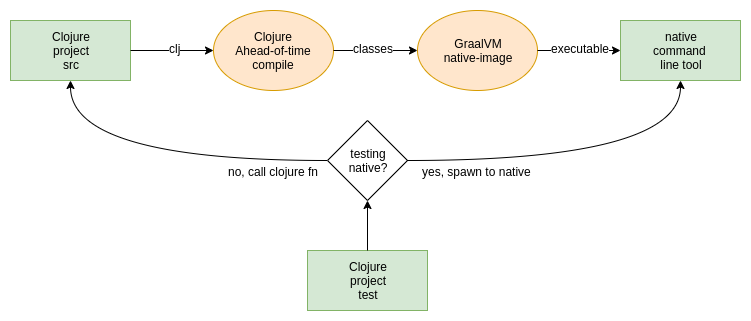
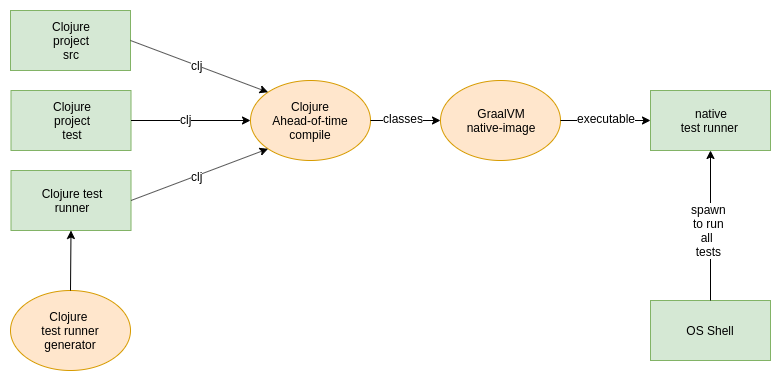

# Clojure GraalVM Testing Strategies

Your Clojure project likely has a suite of tests. Here we explore options
for ensuring your tests also work against your code after it has been natively
compiled with GraalVM.

## Conditional Spawning

This strategy works well when developing a command line tool.

Clojure project source is AOT compiled to classes then natively compiled to
an executable with GraalVM. The executable, in this case, is the command line
tool.

The test suite is setup with a flag to either test Clojure source in the JVM or
against the executable. The suite is run from the JVM twice:

* once with the flag selecting to test against Clojure sources in the JVM
* a second time with the flag selecting to run each test against a spawn of the executable

Examples of this technique can be found in [clj-kondo](https://github.com/borkdude/clj-kondo/blob/875a6bcf660fab60e3037b862edcab23dbc6124a/test/clj_kondo/test_utils.clj#L121)
and [jet](https://github.com/borkdude/jet/blob/92e186a020193645fbca5832b07c5d7c21ef9182/test/jet/test_utils.clj#L19).

## Test Compilation

This strategy could be considered when developing a Clojure library and wanting
to make efforts to ensure it also works when natively compiled with GraalVM.

In this scenario you run your Clojure tests as normal but complement them with
another run from a test runner executable created by GraalVM.

The test runner could be written by hand or automatically generated. It explicitly
requires all test namespaces, this way they will be automatically included
during AOT compilation and hence into the test runner executable.

To compile tests with GraalVM when using Clojure 1.10.x you'll need to use a
[patch from CLJ-1472](../CLJ-1472/README.md).

An example of this technique can be found in
[rewrite-cljs-playground](https://github.com/lread/rewrite-cljs-playground/blob/master/script/graal-tests.sh)
(soon to be rewrite-cljc). A caveat from the author:

> GraalVM's native-image command needs a significant amount of RAM to compile
rewrite-cljc tests in a reasonable amount of time, and still a significant
amount of RAM to run at all. A few ad hoc tests on a 3.5 GHz Quad-Core i7 iMac
with `"-J-Xmx"` at:
>
> * 16g ~3 minutes
> * 8g ~11 minutes
> * 4g - failed with `java.lang.OutOfMemoryError: Java heap space` after ~1 hour
>
> This means running these tests on the free tier of a service such as circleci,
> which has a limit of 4gb, is not currently an option.
>
> I continue to experiment and will report back.
